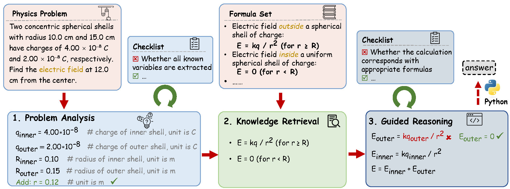

# Physics_Reasoner

## Abstract
Physics problems constitute a significant aspect of reasoning, necessitating complicated reasoning ability and abundant physics knowledge.
However, existing large language models (LLMs) frequently fail due to a lack of knowledge or incorrect knowledge application.
To mitigate these issues, we propose Physics Reasoner, a knowledge-augmented framework to solve physics problems with LLMs.

Specifically, the proposed framework constructs a comprehensive formula set to provide explicit physics knowledge and utilizes checklists containing detailed instructions to guide effective knowledge application.
Namely, given a physics problem, Physics Reasoner solves it through three stages: problem analysis, formula retrieval, and guided reasoning. 
During the process, checklists are employed to enhance LLMs' self-improvement in the analysis and reasoning stages. 
Empirically, Physics Reasoner mitigates the issues of insufficient knowledge and incorrect application, achieving state-of-the-art performance on SciBench with an average accuracy improvement of 5.8\%.


<figure>
    
    <figcaption> Figure 1: Illustration of Physics Reasoner, solving a physics problem using LLMs with the help of the formula set and checklists. The approach contains three stages: problem analysis, knowledge retrieval, and guided reasoning.
</figure>


## Getting Started
### 1. Install Dependencies
Run the following commans to setup your environment.
```
git clone https://github.com/Xinyu-Pang/Physics_Reasoner.git
cd Physics_Reasoner
conda create -n physics_reasoner python=3.10
conda activate physics_reasoner
pip install -r requirements.txt
```

### 2. Configure OpenAI API
You can set up your OpenAI API credentials using either environment variables or a configuration file.

**Option A: Using Environment Variables:**
```
export OPENAI_API_KEY=<your_api_key>
```

**Option B: Using Arguments in the File:**  

In `./code/main/reason.py` file, specify your OpenAI API key in line 18:
```
parser.add_argument("--KEY", type=str, default=<your_api_key>)
```

### 3. Run Experiments
To run the experiments, run the following command:
```
cd code/main
python reason.py
```
You can also specify arguments in `code/main/reason.py`. For example, if you want to log experimental details and load existing results, you can run:
```
python reason.py --debug --load_results False
```
The results will be save in `./data/results` directory.
                                  
## Project Structure
The repository is organized as follows:
- `code/main`: Code for running Physics Reasoner on SciBench
    - `reason.py`: Main experiment script.
    - `model.py`: Different conponents of Physics Reasoner.
    - `prompts/`: few-shot prompts.
- `data/`: Contains SciBench dataset and results.
- `textbooks`: Formula sets for three physics subdatasets in SciBench.
